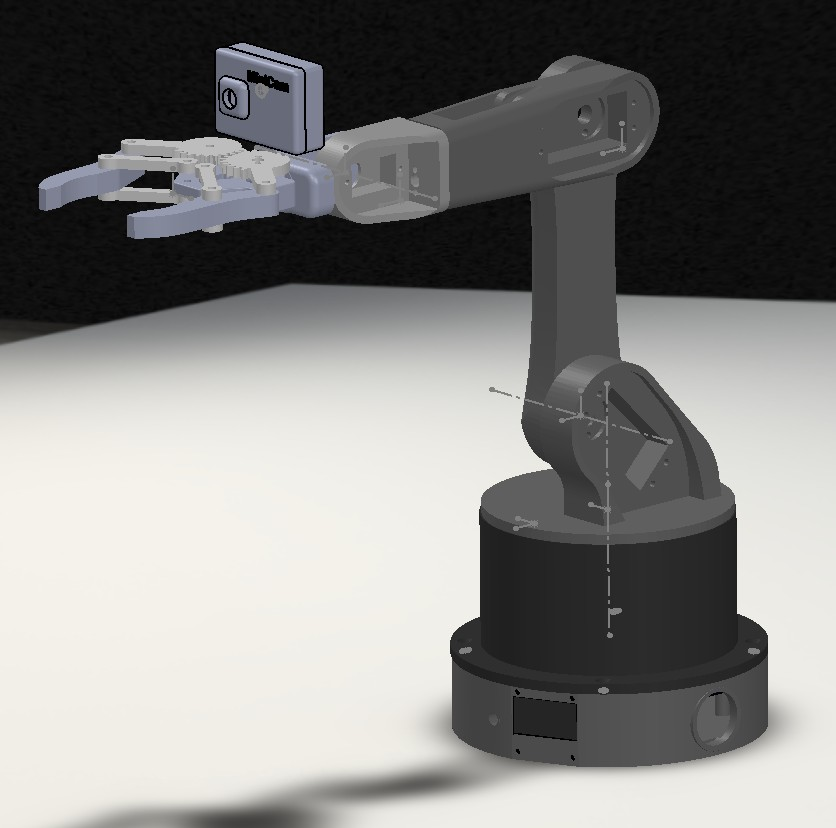
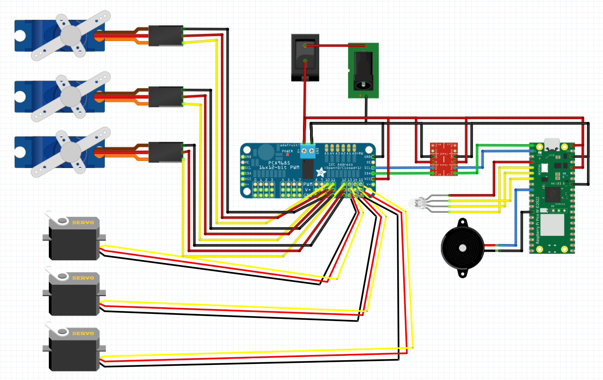
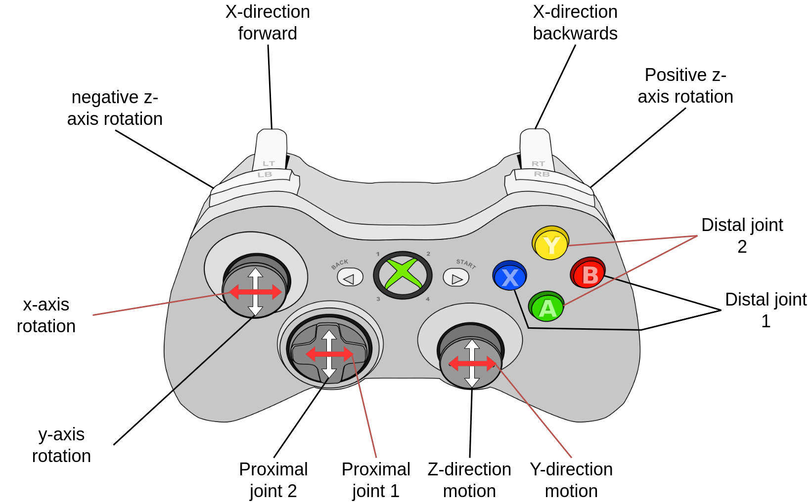
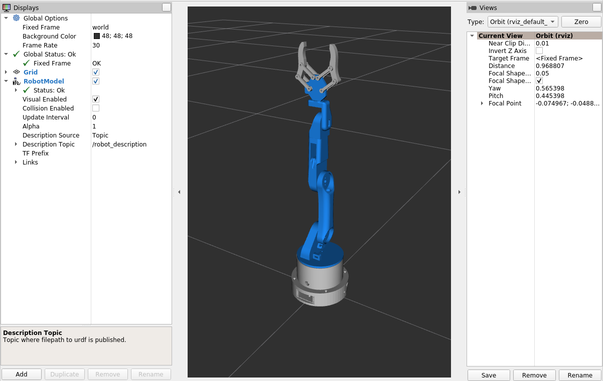

# Mini-Arm
<!--  -->
<div align=center>

<p align="center">

</p>

</div>

[](https://opensource.org/licenses/MIT)
[](https://www.python.org/downloads/)
[](https://github.com/Jshulgach/Mini-Arm/stargazers)
[](https://github.com/Jshulgach/Mini-Arm/network/members)
[](https://jshulgach.github.io/Mini-Arm/)
[](https://github.com/Jshulgach/Mini-Arm/commits/main)

**[📖 Documentation](https://jshulgach.github.io/Mini-Arm/)** | **[🚀 Quick Start](https://jshulgach.github.io/Mini-Arm/getting_started/quickstart.html)** | **[🔧 Hardware Guide](https://jshulgach.github.io/Mini-Arm/hardware/assembly.html)**

The Mini Arm is a miniature version of the [Desktop-Arm](https://github.com/Jshulgach/Desktop-Arm) project, a portable 6DOF 3D-printed open-source robot arm. Plug in a USB cable and immediately enjoy these features:

+ Runs on Raspberry Pico 2 microcontroller using [CircuitPython](https://circuitpython.org/)
+ Internal IK solver to handle joint state calculations on the microcontroller!
+ 95% 3D printable components (aside from nuts & bolts)
+ Total parts cost <= $100
+ Weighs less than 1lb (~0.3kg)

These install instructions were tailored using a Windows 10 OS. There are also setup instructions for [Ubuntu](https://www.gibbard.me/using_the_raspberry_pi_pico_on_ubuntu/) and the [Raspberry Pi](https://www.tomshardware.com/how-to/raspberry-pi-pico-setup) too.

## Contents
- [Repository Structure](#repository-structure)
- [Installation](#installation)
  - [Software](#software)
  - [Hardware](#hardware)
- [Demos](#demos)
  - [Xbox Teleop](#xbox-teleop)
  - [Face Detection](#face-detection)
- [Tests](#tests)
- [Multimodal agentic AI Integration](#multimodal-agentic-ai-integration)
- [AJ GUI](#aj-gui)
- [ROS2 Robot Visualizer](#ros2-robot-visualizer)
- [Acknowledgements](#acknowledgements)

# Repository Structure 

This repository contains everything needed to build, program, and control the Mini-Arm robot:

```
Mini-Arm/
├── ros2/                  # ROS2 packages (also contains Python client)
│   ├── miniarm_core/          # Python client library (pip installable)
│   │   └── miniarm_core/
│   │       ├── client.py      # MiniArmClient class
│   │       └── __main__.py    # CLI entry point
│   ├── miniarm_description/   # URDF & meshes
│   ├── miniarm_moveit_config/ # MoveIt2 configuration
│   └── miniarm_servo/         # Real-time servo control
├── firmware/              # Embedded firmware
│   └── circuitpython/     # CircuitPython for Raspberry Pi Pico
│       ├── code.py        # Main firmware
│       ├── lib/           # CircuitPython libraries
│       └── *.uf2          # Pre-built firmware images
├── hardware/              # Physical build resources
│   ├── cad/solidworks/    # SolidWorks CAD files (.SLDPRT, .SLDASM)
│   ├── stl/               # 3D printable STL files
│   └── bom/               # Bill of Materials
├── examples/              # Usage examples and demos
├── tests/                 # Test scripts
├── docs/                  # Documentation (Sphinx)
└── pyproject.toml         # Python package configuration
```

**Key components:**
- `ros2/miniarm_core/` - Pip-installable Python package for controlling the robot
- `firmware/circuitpython/` - CircuitPython firmware for the Raspberry Pi Pico
- `hardware/` - CAD files, STL meshes, and bill of materials
- `ros2/` - ROS2 packages for visualization and advanced control

## Installation

### Python Package

Install the Mini-Arm Python package directly from GitHub:

```bash
# Install from GitHub
pip install git+https://github.com/Jshulgach/Mini-Arm.git

# Or clone and install in development mode
git clone https://github.com/Jshulgach/Mini-Arm.git
cd Mini-Arm
pip install -e .
```

### ROS2 Installation (All Packages)

For ROS2 users, all packages can be built together:

```bash
# Create workspace
mkdir -p ~/miniarm_ws/src
cd ~/miniarm_ws/src

# Clone and symlink
git clone https://github.com/Jshulgach/Mini-Arm.git
ln -s Mini-Arm/ros2/* .

# Build
cd ~/miniarm_ws
colcon build
source install/setup.bash
```

### Firmware Setup

1. **Choose Pico firmware**

    We have provided CircuitPython firmware for both the Pico and Pico2! Find the `.uf2` files in `firmware/circuitpython/`, or download the latest [CircuitPython](https://circuitpython.org/) firmware for the [Pico](https://circuitpython.org/board/raspberry_pi_pico/) or [Pico 2](https://circuitpython.org/board/raspberry_pi_pico_2/). 

2. **Flash the firmware**
   - When you plug in the Pico for the first time with the BOOTSEL button held, a new drive will appear on your computer.
   
   - Move/drag the `.uf2` file to the Pico drive. The Pico will automatically reboot.

3. **Copy the firmware files**
   - Copy the contents of `firmware/circuitpython/code.py` and `firmware/circuitpython/lib/` to the Pico drive.

### Hardware Assembly

1. **Building the arm**
   - Parts list available in [`hardware/bom/bom.xlsx`](hardware/bom/bom.xlsx)
   - STL files for 3D printing in [`hardware/stl/`](hardware/stl/)
   - SolidWorks CAD source files in [`hardware/cad/solidworks/`](hardware/cad/solidworks/)
   - Assembly instructions at [HowToMechatronics](https://howtomechatronics.com/tutorials/arduino/diy-arduino-robot-arm-with-smartphone-control/)

2. **Electrical wiring**

   

---
## Quick Start

### Command Line Interface

After installing the package, use the CLI:

```bash
# Get list of available commands
mini-arm --port COM3

# Or run as a module
python -m mini_arm --port COM3

# Send a specific command
mini-arm --port COM3 --command "get_pose"

# Interactive mode
mini-arm --port COM3 --interactive
```

### Python API

Use the `MiniArmClient` class in your own scripts:

```python
from miniarm_core import MiniArmClient

# Connect to Mini-Arm
client = MiniArmClient(port='COM3', baudrate=115200, verbose=True)

# Send commands
client.send('help')        # List available commands
client.home()              # Move to home position
client.send('get_pose')    # Get current position
client.set_pose(0.135, 0.0, 0.22)  # Move to position

# Context manager support
with MiniArmClient(port='COM3') as client:
    client.home()
    pose = client.get_pose()
    print(f"Current pose: {pose}")
```
```

### Available Commands

The Mini-Arm supports the following commands:
``` 
================================= List of commands =============================================
 movemotor   |  MOTOR VALUE     | // Moves motor A to absolute position B (deg)
 movemotors  |  VALUES          | // Moves motors absolute position B (deg) assimung VALUES is a list
 info        |                  | // Prints info about robot system (motors, grippers, and sensors)
 set_gripper |  VALUE, STRING   | // Gripper command to set the state (open/close) or position
 set_pose    |  VALUES          | // Updates the end effector pose to an absolute cartesian coordinate pose. Pass a list of values (ex: [X,Y,Z] or [X,Y,Z,R,P,Y])
 get_pose    |                  | // Returns the current position and orientation of the robot end effector
 set_joints  |  (DISABLED)      | // Updates the robot joint state. Pass a list of values (ex: [0,0,0,0,0,0])
 get_joints  |                  | // Returns the current robot joint state
 set_led     |  VALUES          | // Set the RGB LED to a specific color using 0-255 values in a 3-element list
 set_delta   |  VALUES          | // Updates the end effector pose with a delta movement relative to the robot's current pose. Pass a list of values (ex: [X,Y,Z] or [X,Y,Z,R,P,Y])
 posture     |  (DISABLED)      | // Updates the end effector pose with a Cartesian displacement relative to the robot's origin. Pass a list of values (ex: [X,Y,Z] or [X,Y,Z,R,P,Y])
 controller  |  (DISABLED)      | // Controller-specific message as a long ascii string with buttons and joystick data that gets converted into a delta position. Check 'xbox_utils' for message type details
 help        |                  | // Display available commands
 play_music  |  STRING          | // Play a music file 
 debug       |  STRING          | // Pass 'on' or 'off' to enable or disable the verbose output
 set_rate    |  VALUE           | // Update the main loop rate (Hz)
 trajectory  |  STRING [REPEAT] | // Perform a specified trajectory (e.g. 'circle') with optional repeat argument (true/false)
 stop        |                  | // Stop ongoing traetories
 fsr         |                  | // Read the sensor values from the FSRs
 home        |                  | // Set the robot to its home position
 test        |                  | // Test command to verify output from device
 ================================================================================================
```

---
## Examples

See the `examples/` directory for detailed usage examples:

### [Basic Control](examples/01_basic_control/)
- `basic_demo.py` - Connect and send simple commands
- `position_control.py` - Move end effector to XYZ coordinates
- `gripper_control.py` - Open/close gripper

### [Trajectory Execution](examples/02_trajectory/)
- `circle_trajectory.py` - Execute circular trajectories in 3D space

### [Xbox Controller Teleop](examples/02_xbox_teleop/)


Control the arm with an Xbox controller in real-time:

```bash
cd examples/02_xbox_teleop
python xbox-client.py --port COM3
```

**Features:**
- Real-time end effector control via joysticks
- Gripper control with triggers
- LED status indicators (green = connected)

### [Motion Analysis](examples/03_analysis/)
- `trajectory_command.py` - Generate and execute trajectories
- `trajectory_comparison.py` - Compare commanded vs actual motion
- `convert_c3d_to_csv.py` - Process motion capture data
- `compute_alignment_transform.py` - Align coordinate frames

---

## Tests

Test scripts are organized by functionality in the `tests/` directory:

- **hardware/** - Serial communication and servo control tests
- **kinematics/** - Inverse kinematics solver validation
- **networking/** - TCP/IP and camera streaming tests  
- **visualization/** - 3D rendering and simulation tests

See [tests/README.md](tests/README.md) for details on running tests.

## Multimodal agentic AI Integration

TBD

## AJ GUI
Robot control cana also be done through the Unity version of the "AJ" GUI v1 (Link coming soon), or an SSH terminal to the robot. FOR TCP/IP, quickest way using a python terminal:

## ROS2 Robot Visualizer

The Mini Arm can be visualized in RViz2 using the included ROS2 packages in the `ros2/` directory. Refer to the [build instructions](ros2/README.md) for more information.

<!--  -->
<div align=center>

<p align="center">

</p>

</div>

Feel free to reach out to me in case of any issues.  
If you find this repo useful in any way please do star ⭐️ it so that others can reap it's benefits as well!

## Acknowledgements
This project is inspired from the work done by:
 - [Alberto Abarzua](https://github.com/alberto-abarzua/3d_printed_robot_arm)
 - [Mithi Sevilla](https://github.com/mithi/arm-ik) 
 - [Zenetio](https://github.com/zenetio/RoboND-Kinematics-Project)
 - [Ohara124c41](https://github.com/Ohara124c41/RoboND-Kinematics-Kuka-KR210). 
 - [NitishPuri](https://github.com/NitishPuri/RoboND-Kinematics-Project/)


## License
Copyright 2022-2023 [Jonathan Shulgach](https://www.linkedin.com/in/jonathan-shulgach/)

This Source Code Form is subject to the terms of the Mozilla Public License, v. 2.0. If a copy of the MPL was not distributed with this file, you can obtain one at https://mozilla.org/MPL/2.0/.

[uf2]: (https://fileinfo.com/extension/uf2)
[CircuitPython]: (https://circuitpython.org/)
[PuTTY]: (https://putty.org/)


