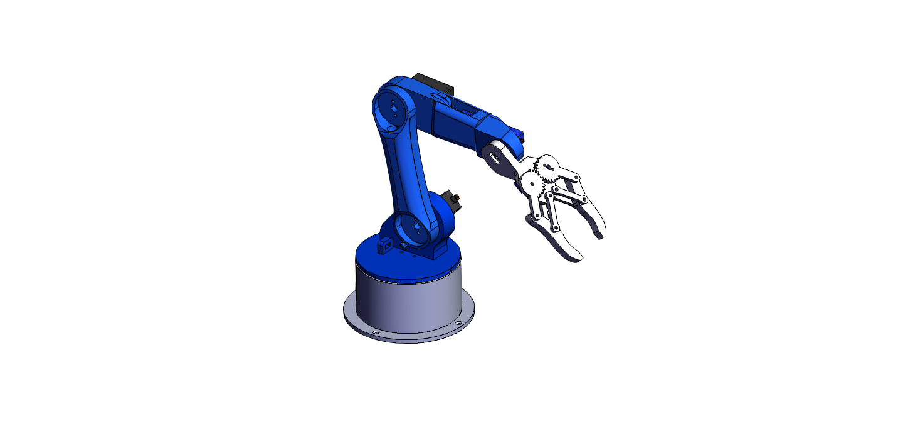

# Mini-Arm


[](https://opensource.org/licenses/MIT)


The Mini Arm is a miniature version of the [Desktop-Arm](https://github.com/Jshulgach/Desktop-Arm) project, a portable 6DOF 3D-printed open-source robot arm. This cool device runs on a 5V 2A DC adapter and features:

+ Runs on Raspberry Pico microcontroller with python code using [CircuitPython](https://circuitpython.org/)
+ Has an IK solver to handle joint state calculation on the microcontroller itself!
+ All 3D printable components (aside from nuts & bolts)
+ Total parts cost <= $60
+ Weighs less than 1lb (0.3kg to be exact)

These install instructions were tailored using a Windows 10 OS. There are also setup instructions for [Ubuntu](https://www.gibbard.me/using_the_raspberry_pi_pico_on_ubuntu/) and the [Raspberry Pi](https://www.tomshardware.com/how-to/raspberry-pi-pico-setup) too.


# Where to start ? 
This GitHub repository contains Installation and Quick Start instructions for the Mni Arm project. Here is a description of the repository structure:
* `miniarm_ros` - Contains ROS packages for the Mini Arm
* `pico` - Contains CircuitPython firmware and code for the Mini Arm using a Raspberry Pico microcontroller
* `tests` - Python test scripts for the package
* `XboxClient` - Teleop script to run on a PC with a connected Xbox controller

## Installation

### Software:
1. It is recommended to use a virtual environment to manage dependencies. To create a new virtual environment with [anaconda](https://www.anaconda.com/products/individual), use the following command:
   ```bash
   conda create -n miniarm python=3.10
   conda activate miniarm
   ```
2. Download the repository using git:
   ```bash
   git clone https://github.com/Jshulgach/Mini-Arm.git
   cd Mini-Arm
   ```
3. To install dependencies, use the provided requirements file:
   ```bash
   pip install -r requirements.txt
   ```

### Hardware:

1. Building the arm
   + The full list of parts needed to assemble the arm can be found in the [B.O.M](https://github.com/Jshulgach/Desktop-Arm/blob/master/doc/bom.xlsx).
   + Files for 3D printing can be found on [HowToMechatronics](https://thangs.com/designer/HowToMechatronics/3d-model/Robotic%20Arm%203D%20Model-38899) with [assembly instructions](https://howtomechatronics.com/tutorials/arduino/diy-arduino-robot-arm-with-smartphone-control/)

2. Electrical wiring

   

---
## Demos

---
### Xbox Teleop

When the arm first turns on, the LED will change to green to indicate successful connection to the network. A blue light indicates a successful connection to the server with a client. Open the `xbox-client.py` file and set `COMM_TYPE` to the same type set for Mini Arm in the `settings.toml` file. Plug in a controller, open a terminal in the directory containing the `xbox-client.py` file, then run the python file:
```
python xbox-client.py
```

### AJ GUI (In Progress) 
Robot control cana also be done through the Unity version of the "AJ" GUI v1 (Link coming soon), or an SSH terminal to the robot. FOR TCP/IP, quickest way using a python terminal:

### ROS2 Robot Visualizer
The Mini Arm can be visualized in RViz2 using the included ROS2 packages. Refer to the [build instructions](/miniarm_ros/README.md) for more information.


Feel free to reach out to me in case of any issues.  
If you find this repo useful in any way please do star ⭐️ it so that others can reap it's benefits as well!

## Acknowledgements
This project is inspired from the work done by:
 - [Alberto Abarzua](https://github.com/alberto-abarzua/3d_printed_robot_arm)
 - [Mithi Sevilla](https://github.com/mithi/arm-ik) 
 - [Zenetio](https://github.com/zenetio/RoboND-Kinematics-Project)
 - [Ohara124c41](https://github.com/Ohara124c41/RoboND-Kinematics-Kuka-KR210). 
 - [NitishPuri](https://github.com/NitishPuri/RoboND-Kinematics-Project/)


## License
Copyright 2022-2023 [Jonathan Shulgach](https://www.linkedin.com/in/jonathan-shulgach/)

This Source Code Form is subject to the terms of the Mozilla Public License, v. 2.0. If a copy of the MPL was not distributed with this file, you can obtain one at https://mozilla.org/MPL/2.0/.

[uf2]: (https://fileinfo.com/extension/uf2)
[CircuitPython]: (https://circuitpython.org/)
[PuTTY]: (https://putty.org/)


